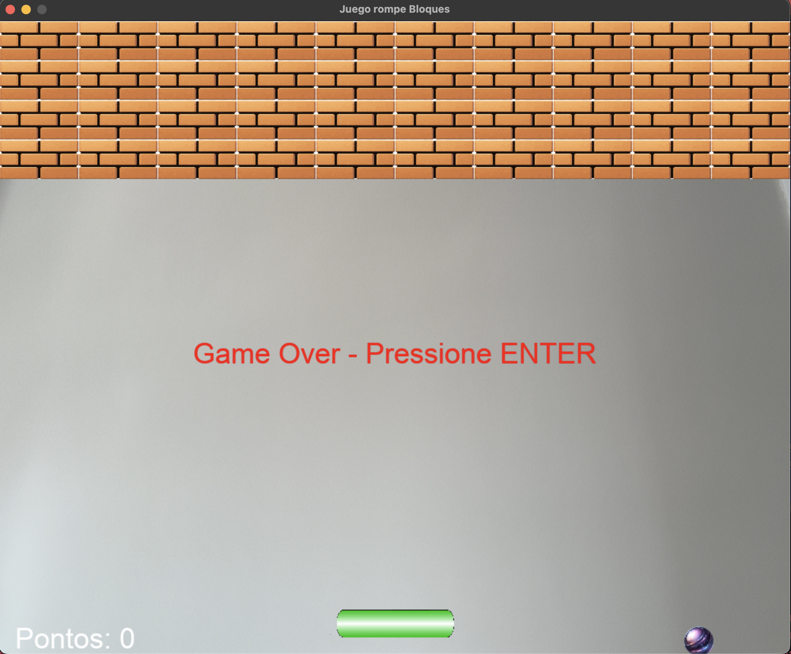

# 🧱 Juego Rompe Bloques con Control por Mano (Pygame + Mediapipe)

Este es un proyecto interactivo de un juego tipo "Arkanoid"/"Breakout" desarrollado con Python, que utiliza visión computacional para controlar la barra del jugador con el movimiento de la mano detectado por la cámara.

## 🎮 Características

- Control de la barra usando el dedo índice (con cámara web).
- Interfaz visual con fondo en tiempo real desde la webcam.
- Gráficos con Pygame y detección de mano con Mediapipe.
- Detección de colisiones con bloques, barra y paredes.
- Sistema de puntaje con reinicio tras Game Over.

## 📸 Captura de pantalla



## ⚙️ Requisitos

- Python 3.10
- Cámara web activa

Instalación de dependencias:

```bash
pip install -r requirements.txt